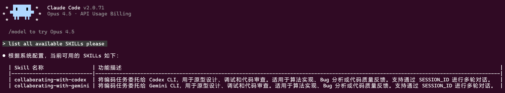

<div align="center">

**Agent Skills 集合 —— 让 Claude 与多模型/工具无缝协作**

[](https://opensource.org/licenses/MIT) [](https://claude.ai/code) [](https://x.com/intent/tweet?text=GudaCC%20Skills：Claude%20Code%20Agent%20Skills%20集合%20https://github.com/GuDaStudio/skills%20%23AI%20%23Coding%20%23ClaudeCode) [](https://www.facebook.com/sharer/sharer.php?u=https://github.com/GuDaStudio/skills) [](https://t.me/share/url?url=https://github.com/GuDaStudio/skills&text=GudaCC%20Skills：Claude%20Code%20Agent%20Skills%20集合)

⭐ 在 GitHub 上给我们点星~您的支持对我们意义重大！ 🙏😊

[English](./docs/README_EN.md) | 简体中文

</div>

---

## 一、项目简介

**Agent Skills** 是 [Anthropic 推出的](https://platform.claude.com/docs/en/agents-and-tools/agent-skills/overview)模块化能力扩展机制，让 LLM 能够按需加载专业领域知识与工作流。本仓库收录了 **GudaStudio** 开发的 Agent Skills 集合，实现 Claude 与其他 AI 模型、工具的无缝协作。

### 已收录的 Skills

| Skill | 功能描述 | 协作模型 |
|-------|----------|----------|
| [collaborating-with-codex](./collaborating-with-codex) | 将编码任务委托给 Codex CLI，用于原型开发、调试和代码审查 | OpenAI Codex |
| [collaborating-with-gemini](./collaborating-with-gemini) | 将编码任务委托给 Gemini CLI，用于原型开发、调试和代码审查 | Google Gemini |

---

## 二、快速开始

### 0. 前置要求

请确保已安装并配置以下工具：

- [Claude Code](https://docs.claude.com/docs/claude-code) (v2.0.56+)
- [Codex CLI](https://github.com/openai/codex) (若使用 collaborating-with-codex)
- [Gemini CLI](https://github.com/google-gemini/gemini-cli) (若使用 collaborating-with-gemini)

### 1. 获取仓库

```bash
# 克隆到任意位置
git clone --recurse-submodules https://github.com/GuDaStudio/skills
cd skills
```

### 2. 安装 Skills

提供安装脚本，支持灵活选择安装范围和目标位置。

**查看可用 Skills：**

```bash
./install.sh --list
```

**方式一：一键安装所有 Skills**

```bash
# 用户级安装（所有项目生效）
./install.sh --user --all

# 项目级安装（仅当前项目生效，需在项目根目录执行）
./install.sh --project --all
```

**方式二：选择性安装**

```bash
# 仅安装 collaborating-with-codex
./install.sh --user --skill collaborating-with-codex

# 安装多个指定 Skill
./install.sh --user -s collaborating-with-codex -s collaborating-with-gemini
```

**方式三：自定义安装路径**

```bash
./install.sh --target /your/custom/path --all
```

<details>
<summary>点击查看完整参数说明</summary>

| 参数 | 简写 | 说明 |
|------|------|------|
| `--user` | `-u` | 安装到用户级目录 (`~/.claude/skills/`) |
| `--project` | `-p` | 安装到项目级目录 (`./.claude/skills/`) |
| `--target <path>` | `-t` | 安装到自定义路径 |
| `--all` | `-a` | 安装所有可用 Skills |
| `--skill <name>` | `-s` | 安装指定 Skill（可多次使用） |
| `--list` | `-l` | 列出所有可用 Skills |
| `--help` | `-h` | 显示帮助信息 |

</details>

### 3. 验证安装

启动 Claude Code 后，Skills 会自动加载。可通过以下方式验证：

- 让claude列出所有skill：`list all available SKILLs please`
- Claude 应能识别并调用 `collaborating-with-codex` 和 `collaborating-with-gemini`
  

### 4. （🎊可选，但强烈推荐）配置提示词
为让本SKILLS集合更加Claude Code等CLI，我们强烈推荐您在 `~/.claude/CLAUDE.md`中 配置/追加 以下提示词。

````markdow
# CLAUDE.md

## 0. Global Protocols

所有操作必须严格遵循以下系统约束：

- **交互语言**：与工具或模型交互强制使用 **English**；用户输出强制使用 **中文**。
- **多轮对话**：如果工具或模型返回的有可持续对话字段 ，比如 `SESSION_ID`，表明工具支持多轮对话，此时记录该字段，并在随后的工具调用中**强制思考**，是否继续进行对话。例如， Codex/Gemini有时会因内部工具调用中断会话，若没有得到需要的回复，则应继续对话。
- **沙箱安全**：严禁 Codex/Gemini 对文件系统进行写操作。所有代码获取必须在PROMPT中**明确要求**， 返回 `Unified Diff Patch`，严禁Codex/Gemini做任何真实修改。
- **代码主权**：外部模型生成的代码仅作为逻辑参考（Prototype），最终交付代码**必须经过重构**，确保无冗余、企业级标准。
- **风格定义**：整体代码风格**始终定位**为，精简高效、毫无冗余。该要求同样适用于注释与文档，且对于这两者，严格遵循**非必要不形成**的核心原则。
- **仅对需求做针对性改动**，严禁影响用户现有的其他功能。
- Codex/Gemini 互动方式以SKILL形式给出，**强制积极查看、调用**。两者均需要较长调用时长（系统默认"BASH_DEFAULT_TIMEOUT_MS": "300000"），耐心等待即可。
- 当检测到可并行化执行的任务时，尽一切可能以并行方式执行。例如当有多个 SKILL 相关的bash命令存在时，可使用`run in background`方式**立即**对需要长时间运行的程序进行挂起以便执行下一个命令，达到并行目的。
- 强制遵循 1. Workflow 中的所有Phase，严禁遗漏任何过程。

## 1. Workflow

### Phase 1: 上下文全量检索 (Auggie Interface)

**执行条件**：在生成任何建议或代码前。

1.  **工具调用**：调用 `mcp__auggie-mcp__codebase-retrieval`。
2.  **检索策略**：
    - 禁止基于假设（Assumption）回答。
    - 使用自然语言（NL）构建语义查询（Where/What/How）。
    - **完整性检查**：必须获取相关类、函数、变量的完整定义与签名。若上下文不足，触发递归检索。
3.  **需求对齐**：若检索后需求仍有模糊空间，**必须**向用户输出引导性问题列表，直至需求边界清晰（无遗漏、无冗余）。

### Phase 2: 多模型协作分析 (Analysis & Strategy)

**执行条件**：上下文就绪后，编码开始前。

1.  **分发输入**：：将用户的**原始需求**（不带预设观点）分发给 Codex 和 Gemini。注意，Codex/Gemini都有完善的CLI系统，所以**无需给出过多上下文**。
2.  **方案迭代**：
    - 要求模型提供多角度解决方案。
    - 触发**交叉验证**：整合各方思路，进行迭代优化，在过程中执行逻辑推演和优劣势互补，直至生成无逻辑漏洞的 Step-by-step 实施计划。
3.  **用户确认**：向用户展示最终实施计划（含适度伪代码）。

### Phase 3: 原型获取 (Prototyping)

**执行条件**：实施计划确认后。根据任务类型路由：

- **Route A: 前端/UI/样式 (Gemini Kernel)**
  - **限制**：上下文 < 32k。gemini对于后端逻辑的理解有缺陷，其回复需要客观审视。
  - **指令**：请求 CSS/React/Vue 原型。以此为最终前端设计原型与视觉基准。
- **Route B: 后端/逻辑/算法 (Codex Kernel)**
  - **能力**：利用其逻辑运算与 Debug 能力。
  - **指令**：请求逻辑实现原型。
- **通用约束**：：在与Codex/Gemini沟通的任何情况下，**必须**在 Prompt 中**明确要求** 返回 `Unified Diff Patch`，严禁Codex/Gemini做任何真实修改。

### Phase 4: 编码实施 (Implementation)

**执行准则**：

1.  **逻辑重构**：基于 Phase 3 的原型，去除冗余，**重写**为高可读、高可维护性、企业发布级代码。
2.  **文档规范**：非必要不生成注释与文档，代码自解释。
3.  **最小作用域**：变更仅限需求范围，**强制审查**变更是否引入副作用并做针对性修正。

### Phase 5: 审计与交付 (Audit & Delivery)

1.  **自动审计**：变更生效后，**强制立即调用** Codex与Gemini 同时进行 Code Review，并进行整合修复。
    - 检查项：逻辑正确性、需求覆盖率、潜在 Bug。
2.  **交付**：审计通过后反馈给用户。

## 2. Resource Matrix

此矩阵定义了各阶段的**强制性**资源调用策略。Claude 作为**主控模型 (Orchestrator)**，必须严格根据当前 Workflow 阶段，按以下规格调度外部资源。

| Workflow Phase           | Functionality           | Designated Model / Tool                  | Input Strategy (Prompting)                                   | Strict Output Constraints                           | Critical Constraints & Behavior                              |
| :----------------------- | :---------------------- | :--------------------------------------- | :----------------------------------------------------------- | :-------------------------------------------------- | :----------------------------------------------------------- |
| **Phase 1**              | **Context Retrieval**   | **Auggie** (`mcp__auggie`)               | **Natural Language (English)**<br>Focus on: *What, Where, How* | **Raw Code / Definitions**<br>(Complete Signatures) | • **Forbidden:** `grep` / keyword search.<br>• **Mandatory:** Recursive retrieval until context is complete. |
| **Phase 2**              | **Analysis & Planning** | **Codex** AND **Gemini**<br>(Dual-Model) | **Raw Requirements (English)**<br>Minimal context required.  | **Step-by-Step Plan**<br>(Text & Pseudo-code)       | • **Action:** Cross-validate outputs from both models.<br>• **Goal:** Eliminate logic gaps before coding starts. |
| **Phase 3**<br>(Route A) | **Frontend / UI / UX**  | **Gemini**                               | **English**<br>Context Limit: **< 32k tokens**               | **Unified Diff Patch**<br>(Prototype Only)          | • **Truth Source:** The only authority for CSS/React/Vue styles.<br>• **Warning:** Ignore its backend logic suggestions. |
| **Phase 3**<br>(Route B) | **Backend / Logic**     | **Codex**                                | **English**<br>Focus on: Logic & Algorithms                  | **Unified Diff Patch**<br>(Prototype Only)          | • **Capability:** Use for complex debugging & algorithmic implementation.<br>• **Security:** **NO** file system write access allowed. |
| **Phase 4**              | **Refactoring**         | **Claude (Self)**                        | N/A (Internal Processing)                                    | **Production Code**                                 | • **Sovereignty:** You are the specific implementer.<br>• **Style:** Clean, efficient, no redundancy. Minimal comments. |
| **Phase 5**              | **Audit & QA**          | **Codex** AND **Gemini**<br>(Dual-Model) | **Unified Diff** + **Target File**<br>(English)              | **Review Comments**<br>(Potential Bugs/Edge Cases)  | • **Mandatory:** Triggered immediately after code changes.<br>• **Action:** Synthesize feedback into a final fix. |
````

---

## 三、Skills 详解

### collaborating-with-codex

将编码任务委托给 OpenAI Codex CLI，适用于算法实现、Bug 分析和代码审查。

<details>
<summary>点击查看参数说明</summary>

| 参数 | 类型 | 必填 | 默认值 | 说明 |
|------|------|------|--------|------|
| `--PROMPT` | `str` | ✅ | - | 发送给 Codex 的任务指令 |
| `--cd` | `Path` | ✅ | - | 工作目录根路径 |
| `--sandbox` | `Literal` | ❌ | `read-only` | 沙箱策略：`read-only` / `workspace-write` / `danger-full-access` |
| `--SESSION_ID` | `UUID` | ❌ | `None` | 会话 ID（None 则开启新会话） |
| `--skip-git-repo-check` | `bool` | ❌ | `False` | 是否允许在非 Git 仓库运行 |
| `--return-all-messages` | `bool` | ❌ | `False` | 是否返回完整推理信息 |
| `--image` | `List[Path]` | ❌ | `None` | 附加图片文件到初始提示词 |
| `--model` | `str` | ❌ | `None` | 指定模型（仅在用户明确要求时使用） |
| `--yolo` | `bool` | ❌ | `False` | 跳过所有审批与沙箱限制 |

</details>

<details>
<summary>点击查看使用示例</summary>

**基础调用：**
```bash
python scripts/codex_bridge.py --cd "/project" --PROMPT "分析认证流程"
```

**多轮对话：**
```bash
# 开启新会话
python scripts/codex_bridge.py --cd "/project" --PROMPT "审查 login.py 的安全问题"

# 继续会话
python scripts/codex_bridge.py --cd "/project" --SESSION_ID "uuid-from-response" --PROMPT "针对发现的问题提供修复建议"
```

**获取 Diff 原型：**
```bash
python scripts/codex_bridge.py --cd "/project" --PROMPT "生成添加日志功能的 unified diff"
```

</details>

### collaborating-with-gemini

将编码任务委托给 Google Gemini CLI，适用于算法实现、Bug 分析和代码审查。

<details>
<summary>点击查看参数说明</summary>

| 参数 | 类型 | 必填 | 默认值 | 说明 |
|------|------|------|--------|------|
| `--PROMPT` | `str` | ✅ | - | 发送给 Gemini 的任务指令 |
| `--cd` | `Path` | ✅ | - | 工作目录根路径 |
| `--sandbox` | `bool` | ❌ | `False` | 是否启用沙箱模式 |
| `--SESSION_ID` | `str` | ❌ | `""` | 会话 ID（空字符串则开启新会话） |
| `--return-all-messages` | `bool` | ❌ | `False` | 是否返回完整推理信息 |
| `--model` | `str` | ❌ | `None` | 指定模型（仅在用户明确要求时使用） |

</details>

<details>
<summary>点击查看使用示例</summary>

**基础调用：**
```bash
python scripts/gemini_bridge.py --cd "/project" --PROMPT "分析认证流程"
```

**多轮对话：**
```bash
# 开启新会话
python scripts/gemini_bridge.py --cd "/project" --PROMPT "审查 login.py 的安全问题"

# 继续会话
python scripts/gemini_bridge.py --cd "/project" --SESSION_ID "uuid-from-response" --PROMPT "针对发现的问题提供修复建议"
```

</details>

### 返回值结构

两个 Skill 均返回统一的 JSON 格式：

**成功时：**
```json
{
  "success": true,
  "SESSION_ID": "550e8400-e29b-41d4-a716-446655440000",
  "agent_messages": "模型回复内容...",
  "all_messages": []
}
```

**失败时：**
```json
{
  "success": false,
  "error": "错误信息描述"
}
```

---

## 四、FAQ

<details>
<summary>Q1: 什么是 Agent Skills？</summary>

Agent Skills 是 Anthropic 推出的模块化能力扩展机制。每个 Skill 包含指令、元数据和可选资源（脚本、模板），Claude 会在相关任务时自动使用。Skills 采用渐进式加载，仅在需要时加载相关内容，有效管理上下文窗口。

</details>

<details>
<summary>Q2: 是否需要额外付费？</summary>

**Skills 本身完全免费开源。** 但使用协作模型（Codex、Gemini）可能产生相应的 API 费用，具体取决于各平台的定价策略。

</details>

<details>
<summary>Q3: 多轮对话时 SESSION_ID 有什么作用？</summary>

`SESSION_ID` 用于维护会话上下文。首次调用时返回一个新的 SESSION_ID，后续调用传入该 ID 可继续之前的对话，模型会记住之前的交互内容。每个 SESSION_ID 对应独立的会话，不同会话之间完全隔离。

</details>

<details>
<summary>Q4: 如何确保代码安全？</summary>

建议始终使用 `read-only` 沙箱策略，并在 PROMPT 中明确要求模型返回 `unified diff patch` 而非直接修改文件。外部模型生成的代码仅作为参考原型，最终实现应由 Claude 重构确认。

</details>

---

## 🤝 贡献指南

<details>
<summary>我们欢迎所有形式的贡献！</summary>

### 开发环境配置

```bash
# 克隆仓库（含子模块）
git clone --recurse-submodules https://github.com/GuDaStudio/skills.git
cd skills
```

### 提交规范

- 遵循 [Conventional Commits](https://www.conventionalcommits.org/)
- 提交测试用例
- 更新相关文档

</details>

---

## 📄 许可证

本项目采用 [MIT License](LICENSE) 开源协议。

Copyright (c) 2025 [guda.studio](mailto:gudaclaude@gmail.com)

---

<div align="center">

## 用 🌟 为本项目助力~
[](https://www.star-history.com/#GuDaStudio/skills&type=date&legend=top-left)

</div>
